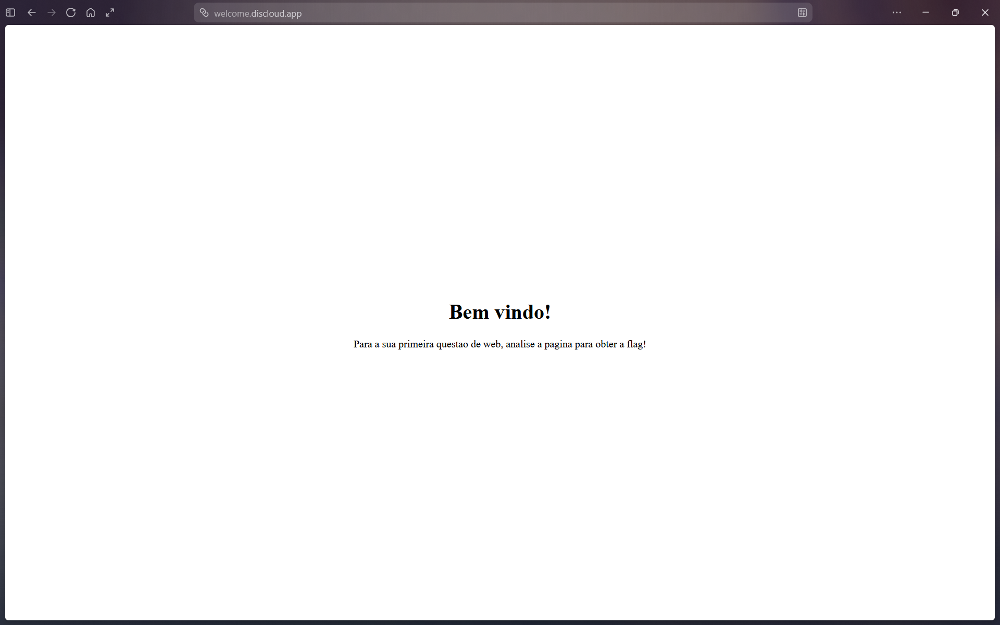
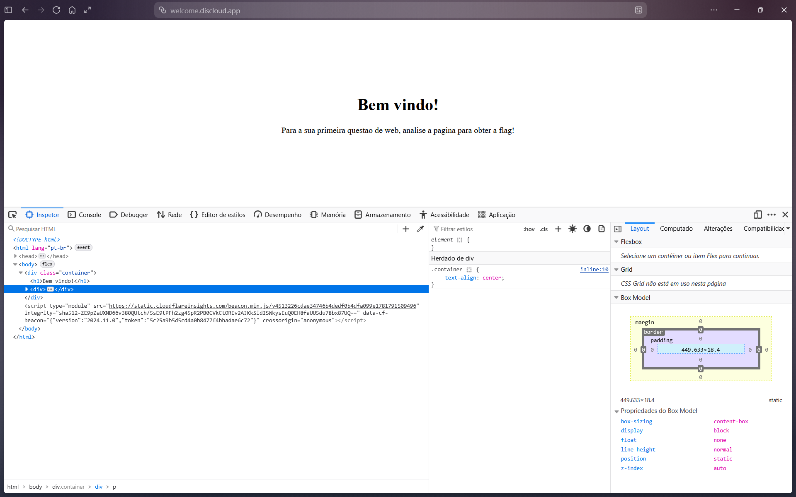
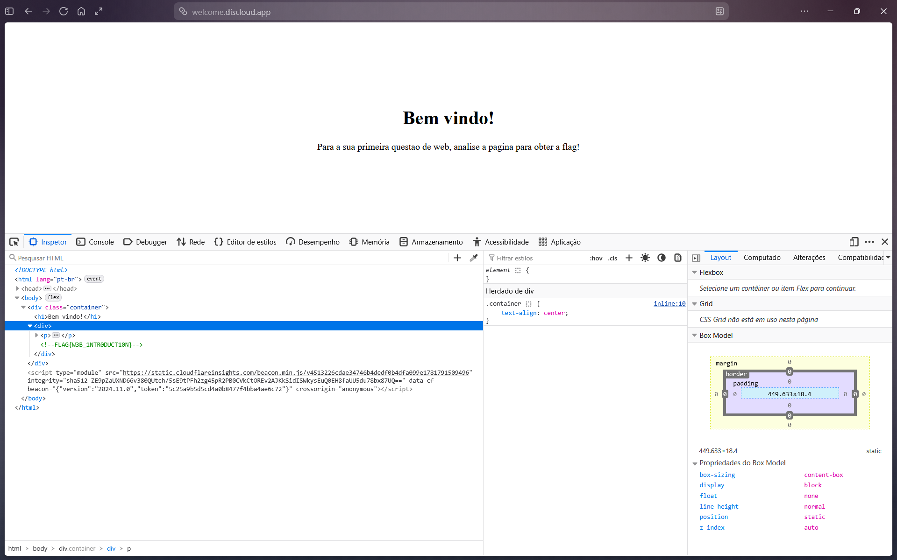

# Bem-vindo! (escolinha ctf)

## Introdução

Este desafio consiste em acessar uma página web e encontrar uma flag escondida em seu código-fonte.

## Análise Inicial

O enunciado da questão é simples e objetivo.
"Acesse o site para obter a flag: [Bem-vindo](https://welcome.discloud.app/)"
Entrando no link, vamos diretamente para o site que nos induz o que fazer.

Print da página do desafio:

A dica é: "analise a página para obter a flag!"

## Interpretação

Com a dica em mãos, assumi que deveria procurar por informações em algum lugar da página. Para isso, utilizei a ferramenta "Inspecionar" (F12 ou clicar com o botão direito do mouse e ir até a mesma).

Ao analisar o código-fonte, procurei por informações que pudessem estar escondidas ou que não fossem exibidas diretamente na página.

Após analisar o código HTML, encontrei a flag escondida dentro de uma `
`:

Print do código HTML:

Print da `
` aberta:

Encontrei, portanto, a flag, que está em verde.

## Flag

`FLAG{W3B_1NTR0DUCT10N}`

## Conclusão

O desafio foi resolvido através da análise do código-fonte da página web. A flag não era visível diretamente para o usuário, mas estava presente dentro de uma `
` do código HTML.

Este desafio mostrou a importância de analisar o código-fonte de uma aplicação web, pois informações que não aparecem visualmente na página podem estar presentes em seu código.
