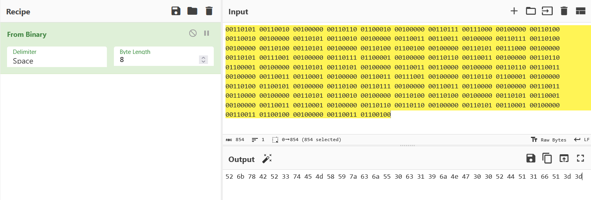
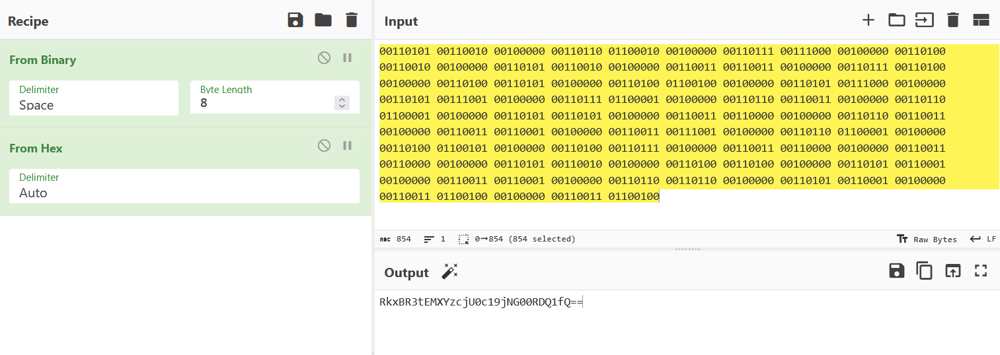
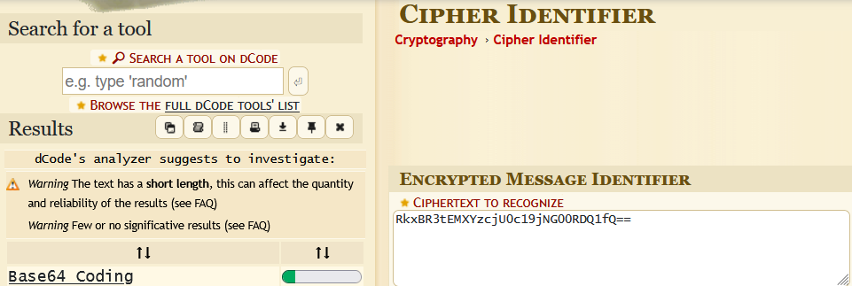
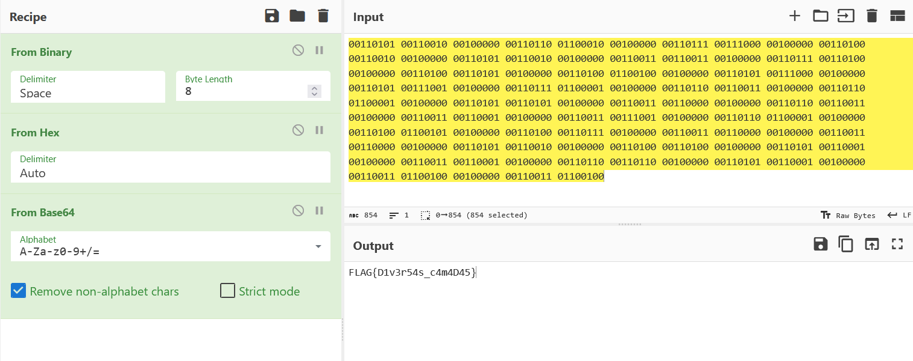

# Cebola Criptográfica (escolinha ctf)

## Introdução

Este desafio consiste em baixar a flag.txt, que está escrita em binário e através de modificações nessa mesma escrita, chegarmos à verdadeira flag.

## Análise Inicial

O enunciado da questão diz o seguinte: "À primeira vista, parece apenas linguagem de máquina bruta, mas nossos analistas acreditam que o remetente empacotou a mensagem em várias camadas para burlar nossos filtros."

A dica é: "..empacotou a mensagem em várias camadas…"

## Interpretação

Com a dica em mãos, assumi que deveria pegar o texto da flag.txt, utilizar a ferramenta Dcode para saber qual o tipo de codificação e CyberChef para poder transformar essas camadas para voltar à mensagem original. Ao colocar a mensagem no CyberChef, fui em "Recipe" e coloquei a opção "From Binary":

Depois fui em "Recipe" novamente e selecionei a opção "From Hex":

Após isso, peguei o texto do output e utilizei o cipher identifier do Dcode para poder saber como a mensagem estava escrita, em qual codificação.

Print do Dcode:

Finalmente, voltei para o CyberChef e converti pela última vez, para Base64:

## Flag

`FLAG{D1v3r54s_c4m4D45}`

## Conclusão

O desafio foi resolvido através da análise de uma sequência de conversões. A flag foi dada, porém criptografada. Primeiramente, o conteúdo estava em binário e foi convertido para Hexadecimal. Em seguida, o conteúdo Hexadecimal foi convertido para uma sequência em Base64, que finalmente foi decodificada para revelar a flag.

O desafio demonstrou a importância de identificar corretamente o formato de dados antes de tentar realizar sua decodificação.
