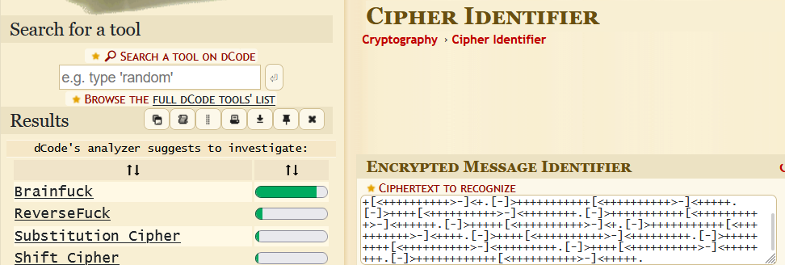
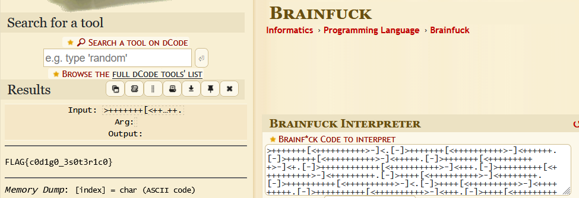

# Sintaxe Alternativa (escolinha ctf)

## Introdução

Este desafio consiste em baixar a flag.txt, que está escrita em uma linguagem que não se entende e através de decodificação, chegar à verdadeira flag.

## Análise Inicial

O enunciado da questão diz o seguinte: "Este amontoado de símbolos é um programa perfeitamente funcional. Você só precisa descobrir como interpretá-lo."

A dica é: "Você só precisa descobrir como interpretá-lo."

## Interpretação

Com a dica em mãos, assumi que deveria pegar o texto da flag.txt, utilizar a ferramenta Dcode para saber qual o tipo de codificação:

Após isso, reutilizei a ferramenta para traduzir a mensagem, obtendo assim a flag.

## Flag

`FLAG{c0d1g0_3s0t3r1c0}`

## Conclusão

O desafio foi resolvido através de decodificação. O desafio demonstrou a importância de identificar corretamente o formato de dados antes de tentar realizar sua decodificação.
